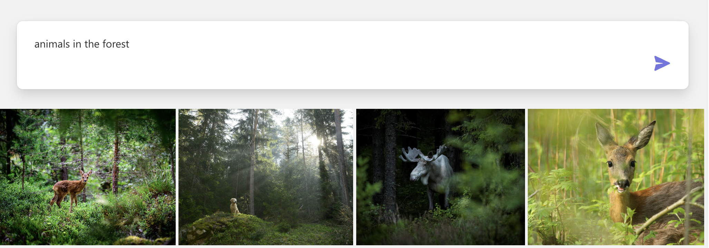
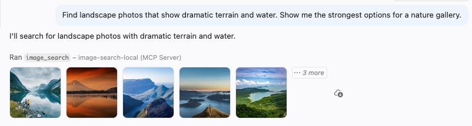
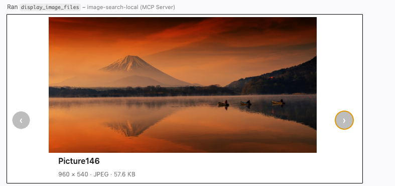

<!--
---
name: Semantic image search
description: A sample full-stack app for searching images using Azure AI Vision multi-modal embeddings API and Azure AI Search integrated vectorization.
languages:
- python
- typescript
- bicep
- azdeveloper
products:
- azure-cognitive-search
- azure-computer-vision
- azure-container-apps
- azure
page_type: sample
urlFragment: image-search-aisearch
---
-->

# Image search with Azure AI Search

This project creates an image search web application and an [MCP (Model Context Protocol)](https://modelcontextprotocol.io) server, both backed by [Azure AI Search](https://learn.microsoft.com/azure/search/search-what-is-azure-search). They allow you to search for images using natural language queries, leveraging multimodal embeddings from the Azure AI Vision API and image descriptions generated by the Azure OpenAI Service.

The web application provides a simple search box and a gallery of matching results. The web app frontend is built with TypeScript/React and the backend with Python/Quart.



The MCP server is built with Python/FastMCP, and includes two tools that can be used by any MCP client, such as VS Code GitHub Copilot.

The `image_search` tool attaches a thumbnail for each match to the tool result, so the agent can inspect the images directly in chat:



The `display_image_files` tool renders selected images in an interactive carousel using MCP apps:



This project uses the sample nature data set from [Vision Studio](https://learn.microsoft.com/azure/ai-services/computer-vision/overview-vision-studio).

## Azure account requirements

In order to deploy and run this example, you'll need:

* **Azure account**. If you're new to Azure, [get an Azure account for free](https://azure.microsoft.com/free/cognitive-search/).
* **Azure account permissions**:
  * Your Azure account must have `Microsoft.Authorization/roleAssignments/write` permissions, such as [Role Based Access Control Administrator](https://learn.microsoft.com/azure/role-based-access-control/built-in-roles#role-based-access-control-administrator-preview), [User Access Administrator](https://learn.microsoft.com/azure/role-based-access-control/built-in-roles#user-access-administrator), or [Owner](https://learn.microsoft.com/azure/role-based-access-control/built-in-roles#owner). If you don't have subscription-level permissions, you must be granted [RBAC](https://learn.microsoft.com/azure/role-based-access-control/built-in-roles#role-based-access-control-administrator-preview) for an existing resource group and deploy to an existing resource group.
  * Your Azure account also needs `Microsoft.Resources/deployments/write` permissions on the subscription level.

## Azure deployment

### Cost estimation

Pricing varies per region and usage, so it isn't possible to predict exact costs for your usage.
However, you can try the [Azure pricing calculator](https://azure.com/e/8ffbe5b1919c4c72aed89b022294df76) for the resources below.

* Azure Container Apps: Consumption plan. Pricing per hour and per request. [Pricing](https://azure.microsoft.com/pricing/details/container-apps/)
* Azure AI Search: Standard tier, 1 replica. Pricing per hour. [Pricing](https://azure.microsoft.com/pricing/details/search/)
* Azure Blob Storage: Standard tier with ZRS (Zone-redundant storage). Pricing per storage and read operations. [Pricing](https://azure.microsoft.com/pricing/details/storage/blobs/)
* Azure Monitor: Pay-as-you-go tier. Costs based on data ingested. [Pricing](https://azure.microsoft.com/pricing/details/monitor/)

To reduce costs, you can switch to free SKUs for various services, but those SKUs may have limitations.

⚠️ To avoid unnecessary costs, remember to take down your app if it's no longer in use,
either by deleting the resource group in the Portal or running `azd down`.

### Project setup

#### Local environment

First install the required tools:

* [Azure Developer CLI](https://aka.ms/azure-dev/install)
* [Python 3.10 or later](https://www.python.org/downloads/)
  * **Important**: Python and the pip package manager must be in the path in Windows for the setup scripts to work.
  * **Important**: Ensure you can run `python --version` from console. On Ubuntu, you might need to run `sudo apt install python-is-python3` to link `python` to `python3`.
* [Node.js 14+](https://nodejs.org/en/download/)
* [Git](https://git-scm.com/downloads)
* [Powershell 7+ (pwsh)](https://github.com/powershell/powershell) - For Windows users only.
  * **Important**: Ensure you can run `pwsh.exe` from a PowerShell terminal. If this fails, you likely need to upgrade PowerShell.

Then bring down the project code:

1. Create a new folder and switch to it in the terminal
1. Run `azd auth login`
1. Run `azd init -t image-search-aisearch`
    * note that this command will initialize a git repository and you do not need to clone this repository

### Deploying from scratch

Execute the following command, if you don't have any pre-existing Azure services and want to start from a fresh deployment.

1. Run `azd up` - This will provision Azure resources and deploy this sample to those resources, including building the search index based on the files found under `pictures/`.
    * **Important**: Beware that the resources created by this command will incur immediate costs, primarily from the AI Search resource. These resources may accrue costs even if you interrupt the command before it is fully executed. You can run `azd down` or delete the resources manually to avoid unnecessary spending.
1. After the application has been successfully deployed you will see a URL printed to the console.  Click that URL to interact with the application in your browser.

## How the indexer works

When `setup_search_service.py` runs (automatically during `azd up`, or manually), it sets up an Azure AI Search indexing pipeline:

1. **Blob upload** – Images from the `pictures/` folder are uploaded to an Azure Blob Storage container. Only files placed directly under `pictures/` are uploaded.
2. **Data source** – A Search data source is configured to point at that blob container.
3. **Skillset** – Two skills are applied to each image:
   * [`VisionVectorizeSkill`](https://learn.microsoft.com/azure/search/cognitive-search-skill-vision-vectorize) generates a 1024-dimensional multimodal embedding using Azure AI Vision.
   * [`ChatCompletionSkill`](https://learn.microsoft.com/azure/search/chat-completion-skill-example-usage) (optional) produces a natural-language description of each image, stored as `verbalized_image`.
4. **Index** – Results are written to a Search index with an `embedding` vector field backed by an HNSW algorithm, plus a built-in AI Vision vectorizer so that query text is embedded at search time without extra code.
5. **Indexer** – Runs the pipeline: blob → normalized images → skills → index projections. Each image within a blob becomes its own indexed document.

At query time, the search service vectorizes the text query using the same AI Vision model and performs an approximate nearest-neighbor search over the stored embeddings.

## Testing deployed endpoints

After running `azd up`, you can test both deployed Container Apps.

### Deployed web app

1. Run `azd env get-value SERVICE_ACA_URI` to get the deployed web app URL.
2. Open the URL in a browser.

### Deployed MCP server

1. Run `azd env get-value SERVICE_MCP_URI` to get the deployed MCP server URL.
2. Append `/mcp` to the URL.
3. In `.mcp.json`, replace the `url` for the `image-search-azure` entry under `mcpServers` with the resulting URL.
4. Open your MCP client and use the `image-search-azure` server.

## Testing local endpoints

You can only run the endpoints locally **after** successfully running `azd up`. If you haven't yet, follow the steps in [Azure deployment](#azure-deployment) above.

### Local web app

1. Run `azd auth login`.
2. Change to the `app` directory and run `./start.ps1` or `./start.sh`, depending on your OS.
3. Open `http://localhost:50505` in a browser.

### Local MCP server

1. Run `azd auth login`.
2. Run `python app/backend/mcp_server.py`.
3. Open your MCP client and use the `image-search-local` server from `.mcp.json`, which connects to `http://localhost:8001/mcp`.

## Adding new images

To add new images to the search index after the initial deployment:

1. Place new JPEG image files directly under the `pictures/` folder. Convert to JPEG first if needed.
2. Run the setup script inside the Python environment to upload and re-index:

   ```bash
   python ./app/backend/setup_search_service.py
   ```

  The script skips blobs that already exist, so only new files will be uploaded. The indexer will then vectorize and index the new images.

## Clean up

To clean up all the resources created by this sample:

1. Run `azd down`
2. When asked if you are sure you want to continue, enter `y`
3. When asked if you want to permanently delete the resources, enter `y`

The resource group and all the resources will be deleted.
